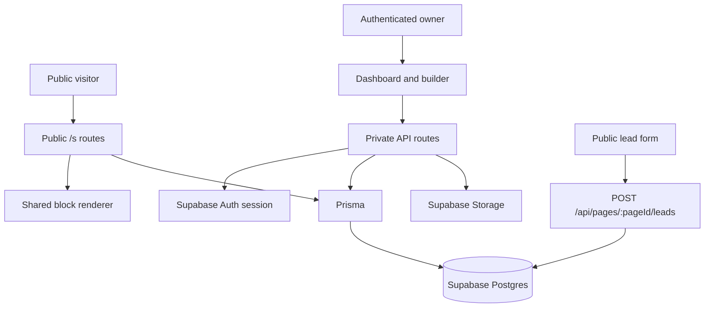

# Architecture

Pageforce is a compact full-stack SaaS MVP built around a reusable JSON page schema. Authenticated users manage sites and pages in the dashboard and builder; public visitors view published pages and submit lead forms without logging in.

## System Boundaries

- Public routes: `/s/[siteSlug]` and `/s/[siteSlug]/[pageSlug]` render published pages with content and do not require auth.
- Guarded routes: `/dashboard` and `/builder` require the current Supabase user.
- Private API routes: read or mutate app data only after checking the Supabase session and enforcing ownership through `Site.userId`.
- Public lead API: accepts visitor submissions without auth, then validates payloads, caps body size, preserves the honeypot guard, and verifies the source page/form.
- Upload API: requires an authenticated owner, validates page ownership, and writes accepted image files to Supabase Storage.

## Data Ownership

Supabase Auth owns users in `auth.users`. Pageforce does not duplicate users in Prisma.

Application data lives in Prisma-managed tables:

- `Site` stores `userId`, site slug, optional global header/footer JSON, pages, and lead submissions.
- `Page` belongs to `Site`, stores page routing metadata, section modes, and the live builder schema.
- `LeadSubmission` belongs to `Site` and stores submitted form data plus the originating block id.

The critical authorization rule is: private page, site, lead, and upload operations must prove `Site.userId` matches the current Supabase Auth user id.

## Builder Schema Contract

The page JSON schema is the product contract. A block type is complete only when it has:

- TypeScript types in `src/types/blocks.ts`.
- Default factories and labels in `src/lib/blocks.ts`.
- Validation in `src/lib/validators.ts`.
- Rendering in `src/components/blocks/BlockRenderer.tsx`.
- Editing controls under `src/components/builder/block-editors/`.

Builder and public pages share rendering logic, so a block edited in the builder is the same block visitors see after save.

## Save and Publish Model

Pageforce uses live save instead of a separate publish step.

- Builder saves write the current schema to `Page.schema`.
- There is no separate publish snapshot in the MVP.
- Pages with at least one block become publicly renderable.
- Blank pages remain `DRAFT` and do not render publicly.
- Public routes render only `PUBLISHED` pages with content.

This keeps the MVP workflow simple: create, edit, save, share the public URL.

## Lead Capture Flow

Lead Form blocks can use one of three delivery modes:

- `capture`: public form posts to `POST /api/pages/[pageId]/leads` and stores a `LeadSubmission`.
- `mailto`: browser submits to a mailto action.
- `actionUrl`: browser submits to an external URL.

The capture endpoint is intentionally public because visitors submit forms from public pages. Safety comes from payload validation, size limits, honeypot handling, and page/form verification rather than requiring visitor auth.

## Environment Safety

Local development should use the `pageforce-dev` Supabase project with `PAGEFORCE_ENV="development"`. Production uses `pageforce-prod` with `PAGEFORCE_ENV="production"`.

Prisma scripts are guarded:

- Local/dev schema changes: `npm run prisma:migrate`.
- Production migration deployment: `npm run prisma:deploy`.

Never run dev migrations against production.
