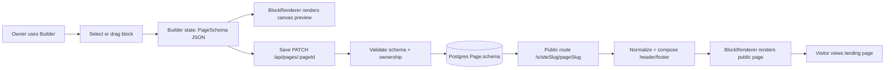
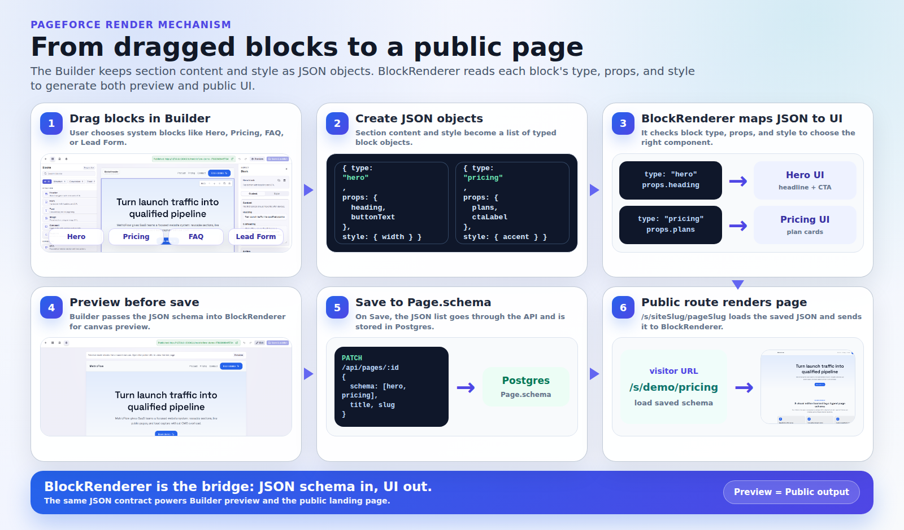

# Render Mechanism Slide

This page is a slide-ready explanation of how Pageforce renders a page. It is written for two audiences at once: product viewers can follow the edit/save/share story, and technical viewers can see the schema, API, database, and renderer boundaries.

## Main Flow



> Pageforce does not store generated HTML. It stores typed JSON, then renders that JSON into UI through a shared component.

## Three-Step Visual Story

| 1. Edit | 2. Preview / Save | 3. Render |
| --- | --- | --- |
|  |  |  |
| The owner edits blocks in the Builder. | The same schema is previewed, validated, and saved. | The public route reads the live schema and renders it for visitors. |

## Talking Points

For non-technical viewers:

- A landing page is made of blocks such as Hero, Image, Pricing, FAQ, and Lead Form.
- Editing in the Builder updates structured page data instead of hand-written HTML.
- After Save, the public URL uses that saved data to render the real page.
- Builder preview and public render stay aligned because they use the same renderer.

For technical viewers:

- The public contract is `PageSchema` version 2 in `src/types/blocks.ts`.
- Defaults live in `src/lib/blocks.ts`; validation lives in `src/lib/validators.ts`.
- Save calls `PATCH /api/pages/[pageId]`, checks the Supabase user through `Site.userId`, validates the payload, normalizes the schema, and writes it to `Page.schema`.
- `pagePublicationData()` marks pages with at least one block as `PUBLISHED`; blank pages remain `DRAFT`.
- Public `/s` routes only render `PUBLISHED` pages with content.
- Builder canvas, builder preview, and public pages share `src/components/blocks/BlockRenderer.tsx`.
- Global header/footer schemas are composed around the page schema before public render unless the page hides them.

## Speaker Script

"Pageforce's render mechanism centers on a JSON schema. In the Builder, the owner adds blocks and edits content; React state holds that schema and `BlockRenderer` turns it into a live canvas preview. When the owner saves, the schema goes through the page API, where Pageforce checks ownership and validates the shape before storing it in Postgres as `Page.schema`. The public `/s/...` route does not require login. It loads the published page, normalizes the schema, composes global header and footer sections when needed, then uses the same `BlockRenderer` to render the visitor-facing landing page. So the system has one source of truth: the schema, not separate editor HTML and public HTML."

## Vietnamese Speaker Script

"Đầu tiên user kéo thả các block của hệ thống như Hero, Pricing. Sau đó thông tin của từng section và style được lưu dưới dạng list object JSON. Builder truyền list JSON đó vào `BlockRenderer`; `BlockRenderer` dựa vào block type, props và style để render đúng giao diện cho user preview. Khi user bấm Save, list object JSON được gửi qua API, validate, rồi lưu vào database ở `Page.schema`. Khi visitor vào `/s/siteSlug/pageSlug`, public route lấy JSON đã lưu đó và đưa lại vào `BlockRenderer` để tạo ra giao diện public và hiển thị cho visitor. Điểm chính là: mình không lưu HTML tĩnh, mình lưu JSON schema; `BlockRenderer` là cầu nối biến JSON thành UI."

## Vietnamese Step-by-Step Talk Track

1. User kéo thả block trong Builder, ví dụ Hero hoặc Pricing.
2. Nội dung section, props và style được lưu thành list JSON object.
3. Builder truyền list JSON đó vào `BlockRenderer`.
4. `BlockRenderer` đọc `type`, `props`, `style` để chọn đúng giao diện và render preview.
5. Khi user bấm Save, list JSON được gửi qua API và lưu vào `Page.schema`.
6. Khi visitor vào `/s/siteSlug/pageSlug`, public route lấy JSON đã lưu và đưa vào cùng `BlockRenderer` để render public page.

## Slide Asset

Use this generated overview image when a single visual is better than the full Mermaid diagram:



Regenerate it with:

```bash
npm run demo:render-diagram
```
